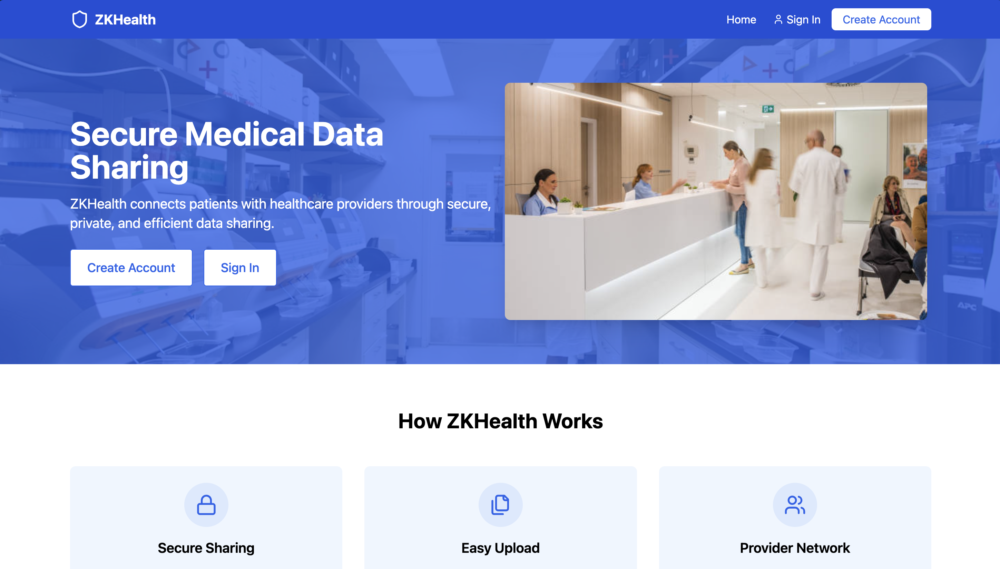
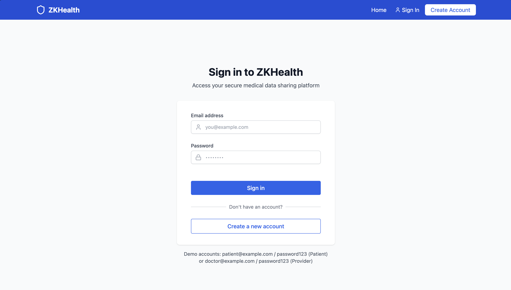
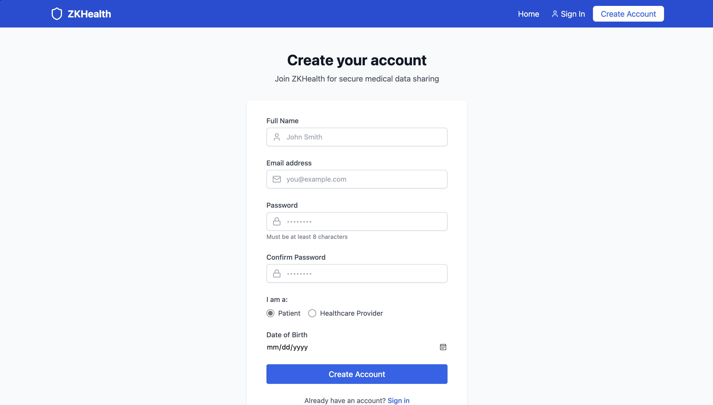
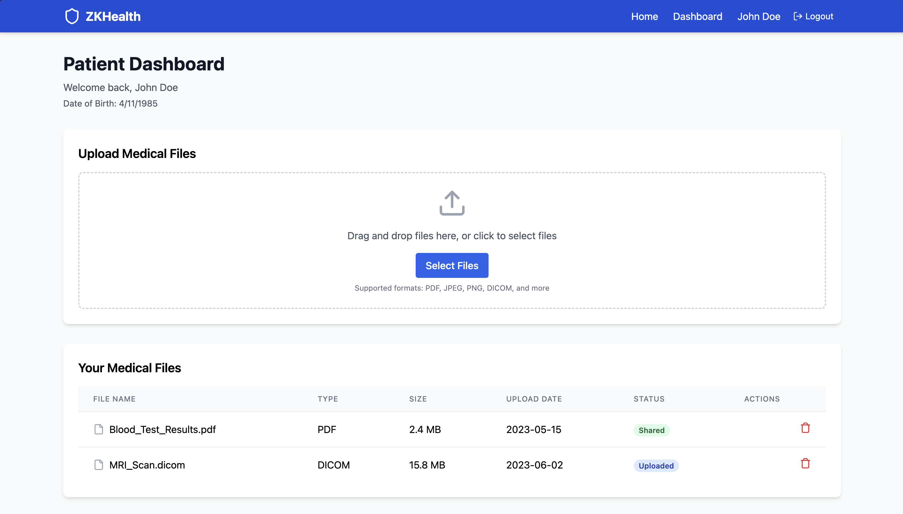
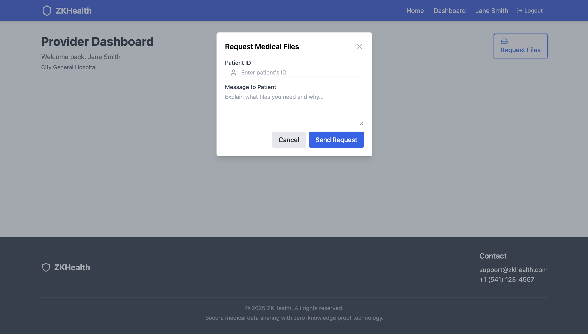

# 🧬 ZKHealth – Zero-Knowledge Health Record Sharing
**Built for Stellar Consensus Hackathon 2025**  
_Web3 UX doesn’t have to suck. We proved it._

---

## 🚀 User Interface/Experience

### Watch the demo!

---

## 🔥 Why: The Narrative

**What we’re building**  

ZKHealth is a privacy-first healthcare dapp that empowers patients to **securely share medical files** like vaccine records, test results, and diagnosis documents—with **full control over who sees what**. Using zero-knowledge proofs, we let patients prove that a **file exists and is authentic without exposing its contents**. But that’s just the start: users can also selectively share the actual PDF files with trusted healthcare providers through a **built-in encrypted file delivery system**, enabling **frictionless verification and care coordination**.

**What it fixes**  

Today’s medical record sharing is awful. Patients are forced to navigate a maze of portals, faxes, emails, and paper forms just to share basic health records. Providers often operate in disconnected systems with no real-time access to verified patient data, leading to gaps in information, delayed diagnoses, and slower care delivery. Worse, current solutions require users to sacrifice privacy or control, exposing their full health history even when only one file is needed. ZKHealth fixes this by giving patients full control over what they share, when they share it, and who gets to see it. Patients can prove they have a valid record (like a COVID vaccine) without revealing the document, or securely share the full file only when needed — all in a few taps, from their computer, without logging into five different portals. It’s faster for providers, private for patients, verifiable on-chain, and a hell of a lot cooler.

**Who it helps**  

Me. You. Us. 3.5 billion people have access to healthcare and every single one of them has to deal with the inherent problems within the medical file sharing space. We bridge privacy and UX to make sure people understand what of theirs is being shared, for how long, and on the flip side, whether that document is valid.

**Why It’s Important**

As healthcare digitizes and AI enters the clinical space, data privacy, control, and portability are no longer optional — they’re essential. Patients deserve tools that let them share sensitive health records without handing over their entire medical history. Providers need verifiable, tamper-proof records they can trust instantly. And both sides need it to just work — without friction, logins, or blockchain headaches. ZKPS bridges that gap, combining zero-knowledge security with a user experience as smooth as any modern app, setting a new standard for how privacy-preserving medical data can flow in a Web3 world.

**Value Proposition**

🧠 ZK Proofs — prove the existence of a document without revealing it

🪪 Passkey Auth — frictionless, wallet-free login and identity

🌐 On-Chain Anchoring — immutable record of what was shared, when, and by whom

Together, ZKPS delivers Web2-level UX with Web3-grade trust — a true leap forward for decentralized healthcare.
---

## ✅ Implemented Features

- 🔐 **Zero-Knowledge Proofs for File Integrity**  
- 👤 **Passkey Login** via [passkey-kit](https://github.com/kalepail/passkey-kit)  
- 📁 **Drag-and-Drop PDF Upload + Poseidon Hashing**  
- 🚀 **Stellar On-Chain Anchoring** via `manageData`  
- 📤 **Selective File Sharing with Providers**  
- 🧑‍⚕️ **Provider Dashboard**: Receive, verify, and view shared files  
- 🌉 **Seamless Smart Wallet Onboarding with Launchtube**  
- 📲 **Mobile-Optimized, Wallet-Free Flow**  
- ✅ **Live Testnet Deployment with Working Contracts**

---

## 🛠 Technologies Used

- **Frontend**: React, Vite, Tailwind CSS, Framer Motion  
- **ZK Stack**: Circom, SnarkJS, Poseidon Hash  
- **Authentication**: Passkeys via [passkey-kit](https://github.com/kalepail/passkey-kit)  
- **Blockchain**: Stellar Smart Contracts, `manageData`, `Soroban`  
- **Dev Tools**: [js-stellar-sdk](https://github.com/stellar/js-stellar-sdk), [launchtube](https://github.com/stellar/launchtube)  
- **Data Storage**: Off-chain IPFS (local simulation)  
- **Build/Deploy**: Launchtube, Stellar CLI

---

## 📄 Technical Design Docs Overview

> _See full doc at: [`docs/TECHNICAL_DESIGN.md`](https://github.com/val-levy/ZKHealth/tree/main/docs/TECHNICAL_DESIGN.md)_

### System Overview  
A patient-facing app enabling passkey-authenticated file uploads, ZK hashing, proof generation, and on-chain anchoring—verifiable by providers.

### Architecture Diagram  
- User → Uploads file → Poseidon hash → ZK proof → Send + store proof  
- Stellar stores hash in `manageData`  
- Providers verify hash from shared file + compare

### Components  
- `frontend/`: React app with login, upload, sharing views  
- `circuits/`: Circom ZK circuit, input.json generator  
- `stellar/`: Rust contract logic + deployment  
- `scripts/`: CLI for interacting with contracts

### Smart Contracts

#### 🧑‍⚕️ `AgentContract`
Handles role assignment for all agents on the platform—either patients (`PAT`) or providers (`PRO`).

- `register_agent(address, role)` – Registers an address as either a patient or provider  
- `get_role(address)` – Returns the assigned role for a given agent  
- `is_patient(address)` / `is_provider(address)` – Quick role check utilities  
- `delete_agent(address)` – Deregisters an agent and removes their role

This contract provides decentralized role-based access control for the platform.

#### 🔗 `RelationshipContract`
Manages patient-provider relationships and access to records via on-chain IPFS hashes.

- `register_relationship(patient, provider)` – Establishes a link between patient and provider  
- `add_record(patient, provider, record_hash)` – Attaches a file reference to an existing relationship  
- `has_access(patient, provider, record_hash)` – Validates permission to access a record  
- `list_records(patient, provider)` – Lists all records shared in a relationship  
- `list_patient_providers(patient)` / `list_provider_patients(provider)` – Relationship lookups  
- `list_related_agents(agent)` – All related parties for a given address  
- `has_relationship(agent1, agent2)` – Checks bidirectional connection  
- `remove_relationship(patient, provider)` – Cleans up both sides of a relationship and access permissions

These contracts together form the backbone of permissioned, decentralized health data access.

### Design Choices  
- **Off-chain file storage** to ensure GDPR/HIPAA compliance  
- **Poseidon** for ZK-friendly hashing  
- **Stellar `manageData`** to store tamper-proof hash anchors  
- **Passkeys** eliminate wallet UX friction

### Events & Interactions  
- File uploaded → hash stored on-chain  
- ZK proof verified on provider dashboard  
- No blockchain literacy required from user

---

## 📢 Tags & Metadata

- **Repo Name**: `zkps-stellar-consensus-2025`  
- **Topics**: `stellar`, `rust`, `smart-contracts`, `consensus-toronto-2025`  
- **Website Points To**: https://developers.stellar.org/

---

## 📬 Contact

**Authors:** Drew Manley, Val Levy, Armaan Hajar, Finn Fujimura  
**University of Oregon Blockchain Group:** https://www.oregonblockchain.org/  
We slept 2 hours last night but it was worth it
